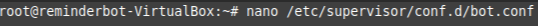
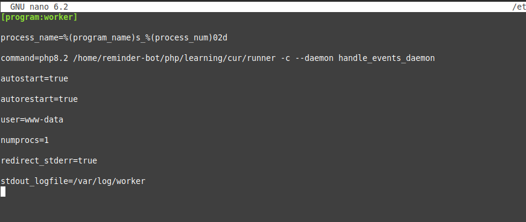
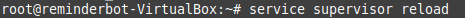
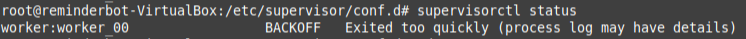
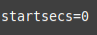
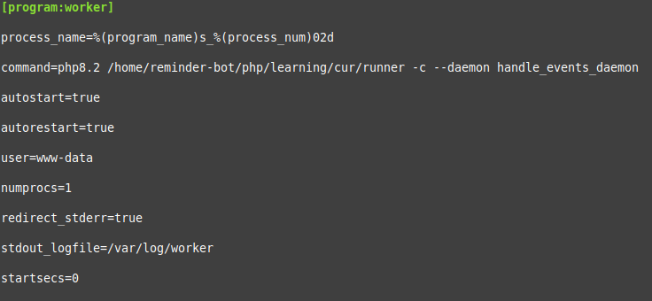
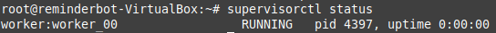
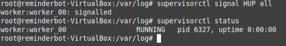

# Вокруг PHP – экосистема веб-приложений

### Домашнее задание № 1.
Конфиг супервизора, положить в /etc/supervisor/conf.d

```
[program:worker]
process_name=%(program_name)s_%(process_num)02d
command=php8.2 ПУТЬДОФАЙЛА_RUNNER -c handle_events_daemon
autostart=true
autorestart=true
user=www-data
numprocs=1
redirect_stderr=true
stdout_logfile=/var/log/worker
```

```
php runner -c save_event --name 'name' --receiver 1 --text 'text' --cron '* * * * *' * * * * * php runner -c handle_events
```

### Решение:

Перемещаю файлы в нужную папку (в данном случае: /home/reminder-bot/php/learning/cur/), затем редактирую файл в супервизорде:



Получаю следующий конфиг:



Перезагружаем супервизорд:



Однако в моем случае после проверки статуса запуска возникает ошибка:

, которая в данном случае решается добавлением строчки:  в конфиг

Итоговый конфиг:



Снова перезагружаем супервизорд:


Скрипт загрузился:



Теперь попробую остановить процесс:



Процесс перезапустился.
